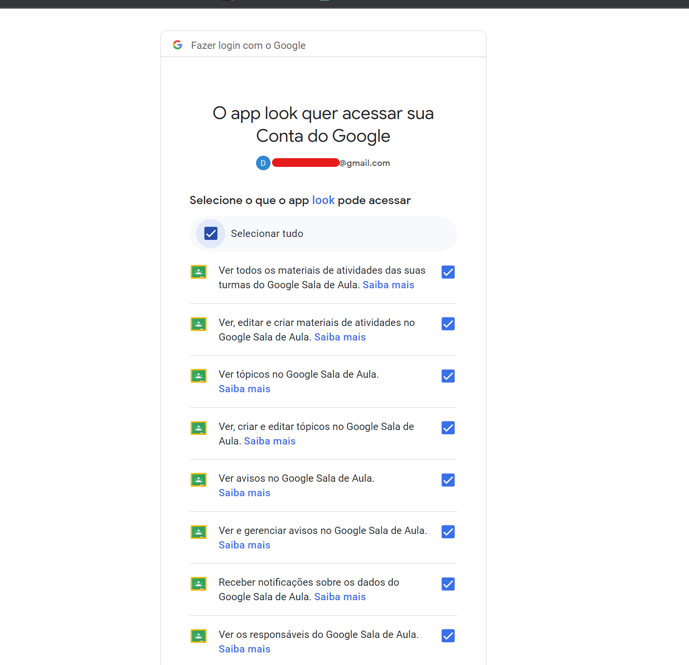
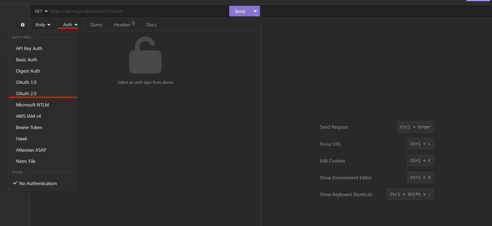
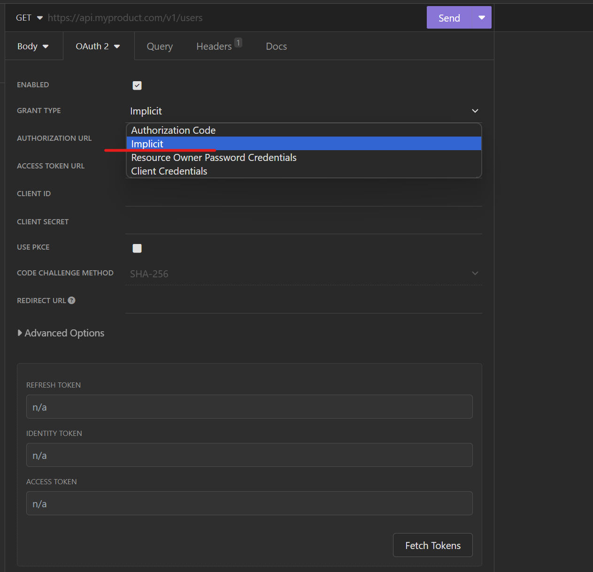
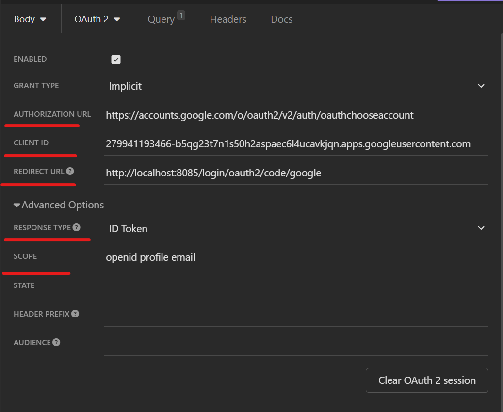
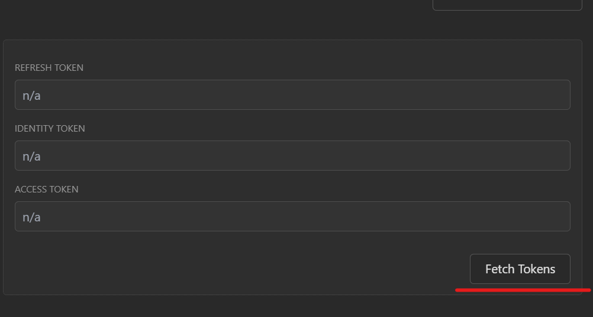
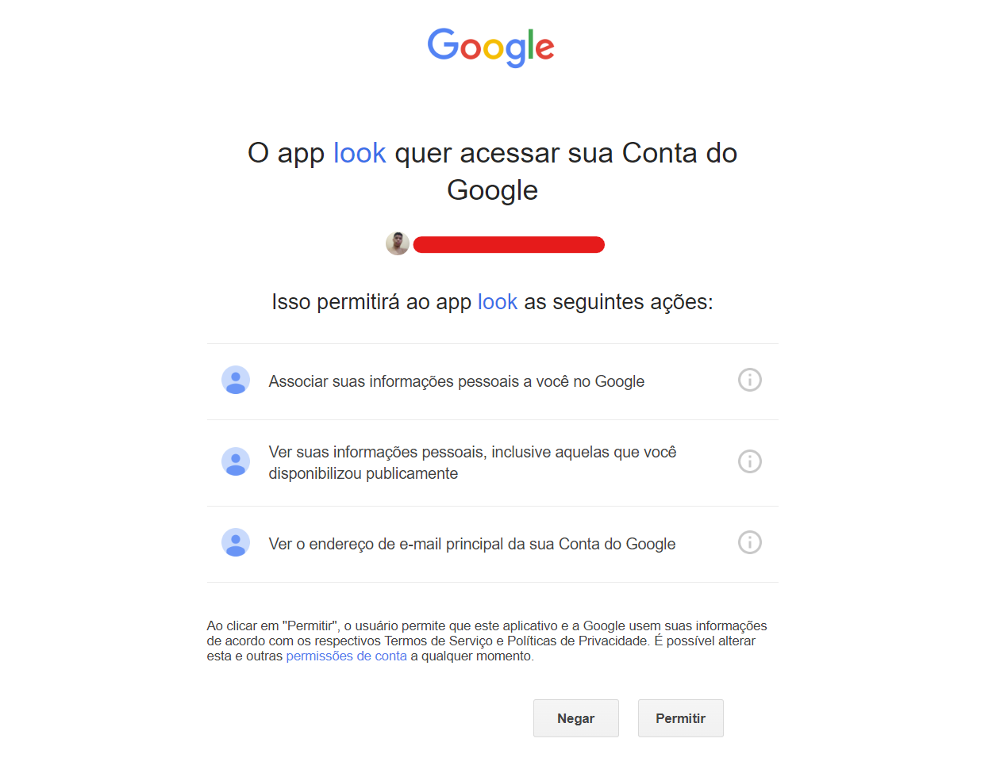
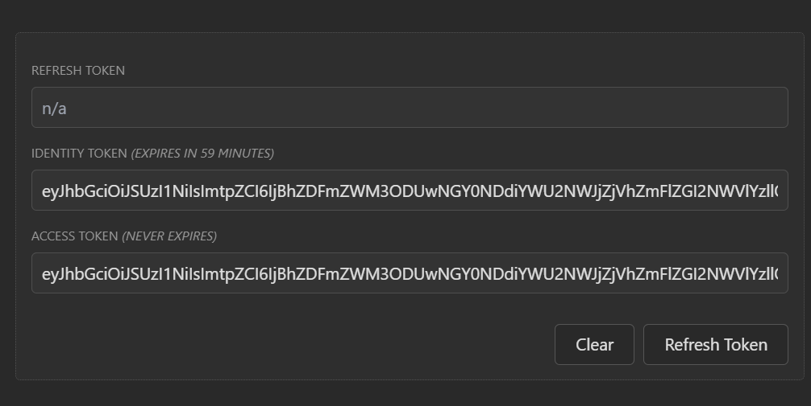
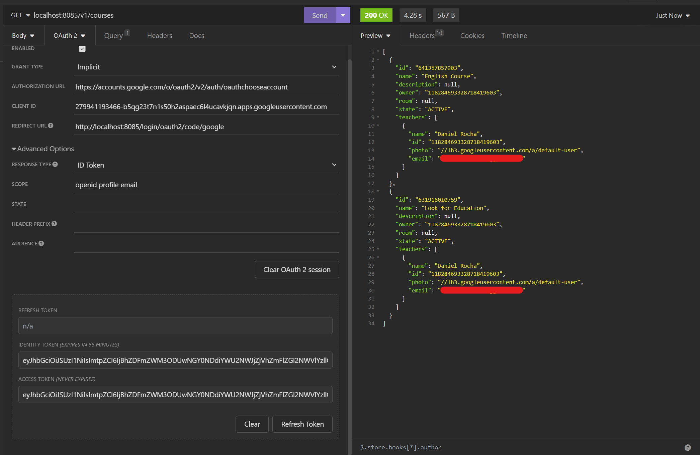
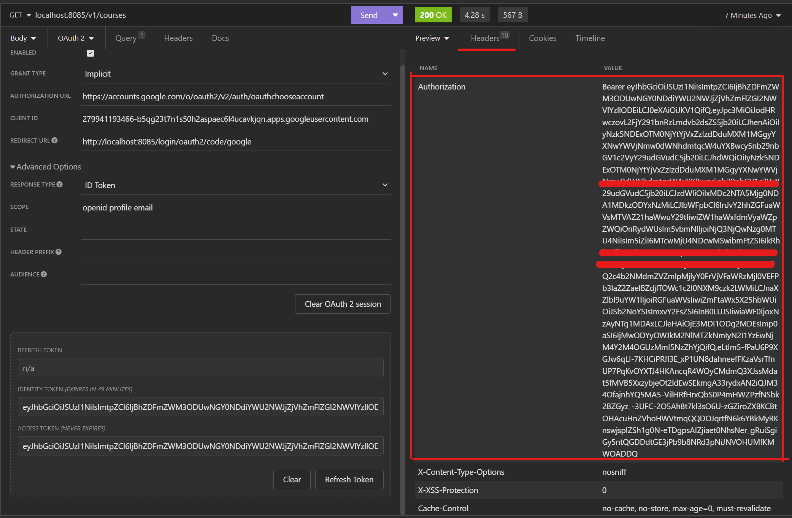

## Table of Contents

- [Code Style](#code-style)
- [Your First Code Contribution](#your-first-code-contribution)
  - [obs](#obs)
  - [Indention](#indention)
  - [Commit message](#commit-message)
- [Setup](#setup)
- [Using](#using)
  - [Insomnia](#insomnia)
  - [Extra](#extra) 
- [Container](#container)
  - [Construíndo a image](#construíndo-a-image)
  - [Iniciando container](#iniciando-container)

## GCP
Acesse a documentação de setup do projeto no CGP [Aqui](docs/gcp-setup.md)

## Code Style:
 - Seguir code style google: [Google Styleguide](google.github.io/styleguide/javaguide.md)

## Your First Code Contribution
### Obs
Adicionar abstracação no package core e implementação especifica no pacote infra. Caso exista somente 
uma implementação para a interface especifica que possua o mesmo nome da interface adicione o sufixo ```Impl```. Exemplo: 
```TeacherService.java``` no *core* e  ```TeacherServiceImpl.java``` em *infra*. 

### Indention
- 4 espaços

### Commit message
- [Conventional Commits](https://www.conventionalcommits.org/en/v1.0.0/)

## Setup
### Configuração do cliente do classroom
Definir variaveis de ambiente ```LOOK_GCLOUD_SERVER_CLIENT_ID``` e ```LOOK_GCLOUD_SERVER_CLIENT_SECRET``` ou definir valores em application.yaml

```yaml
look:
  cloud:
    gcp:
      server:
        # IDs do cliente Classroom - Desktop
        client:
          id: ${LOOK_GCLOUD_SERVER_CLIENT_ID:<default-client-id>}
          secret: ${LOOK_GCLOUD_SERVER_CLIENT_SECRET:<default-secret>}
```

Valores abaixo são exemplos e não funcionam.
- exemplos para cliente id: ```000000000000-b5qg23t7n1s50h2aspaec6l4ucavkjqn.apps.googleusercontent.com```
- exemplos para secret: ```AOCSCX-001ASj1jkBNZgPEa-yQ7SxWUiILA```

### Configuração do cliente OAuth2
Definir variaveis de ambiente ```LOOK_GCLOUD_CLIENT_ID``` e ```LOOK_GCLOUD_CLIENT_SECRET``` ou definir valores em application.yaml
```yaml

spring:
  security:
    oauth2:
      client:
        registration:
          google:
            # IDs do cliente OAuth 2.0 - auth-look - Web
            client-id: ${LOOK_GCLOUD_CLIENT_ID:<default-client-id>}
            client-secret: ${LOOK_GCLOUD_CLIENT_SECRET:<default-secret>}
```

Valores abaixo são exemplos e não funcionam.
- exemplos para cliente id: ```000000000000-b5qg23t7n1s50h2aspaec6l4ucavkjqn.apps.googleusercontent.com```
- exemplos para secret: ```AOCSCX-001ASj1jkBNZgPEa-yQ7SxWUiILA```


#### OBS
Os valores de ***cliente ID*** e ***secret*** são obtidos no Google Cloud Platform (GCP)

### Run


#### Terminal
No diretorio raiz do projeto.
- default profile
````shell
./mvnw spring-boot:run
````
- dev profile

Execute o script ```setup``` (```setupw.cmd``` no Windows) ou faça a etapa de recuperação de arquivo de profile manualmente a seguir:
  - Clone o repositório [look-secret](https://github.com/edu-look/look-secret/tree/main)
  - Copie o arquivo ```application-dev.yaml``` e outros arquivos para ```src/main/resources```
````shell
./mvnw spring-boot:run -Dspring-boot.run.profiles=dev
````
#### IntelliJ
- [How do I activate a Spring Boot profile when running from IntelliJ - ***Stackoverflow***](https://stackoverflow.com/questions/39738901/how-do-i-activate-a-spring-boot-profile-when-running-from-intellij)
- [Spring Boot run configuration - ***Jetbrains***](https://www.jetbrains.com/help/idea/run-debug-configuration-spring-boot.html)
#### Autorizando teacher bot
- Copie e cole o link que foi exibido no terminal no navegador de internet:


- Selecione a conta google para lidar com a integração com o classroom. Obs: A conta deve está como um professor.


#### Acesso aos recursos:
- Acesse [localhost:8085](localhost:8085) e acesse com uma conta de um estudante para testar a API.


## Using
### Insomnia
- Crie uma nova request no Insomnia do tipo GET
- Altere a o tipo de autenticação para OAuth 2.0
  
- Altere o tipo de de concessão para **Implicit**
  
- Adicione as configurações abaixo (O **cliente id** deve ser o mesmo da secção da [configuração do cliente OAuth2](#configuração-do-cliente-oauth2):
  
O cliente ID do exemplo acima pode está inválido, adicione o cliente ID válido.
- Faça login com uma conta de um aluno e recupere o token de autorização
  
  ![Insomnia 5screenshot/03.5.using-insomnia.png)
  
- Token definido
  
- Fazendo chamada para endpoint *v1/courses* 
  

### Extra
Observe que em todas as request com sucesso retorno no Header da resposta o Authorization Token:


## Container
### Construíndo a image
```sh
[docker | podman] build -f Dockerfile -t <image-name>
```

- Exemplo:
```
$ podman build -f Dockerfile -t look-api
```

### Iniciando container
```
[docker | podman] run --net=host -d <image-name>
```

- Exemplo:
```
$ podman run --net=host -d localhost/look-api:latest
```

Observe que há um conjunto de variaveis, por favor defina o conteúdo.
```sh
...
# add env
ENV LOOK_APPLICATION_NAME=
ENV LOOK_GCLOUD_CLIENT_ID=
...
```
